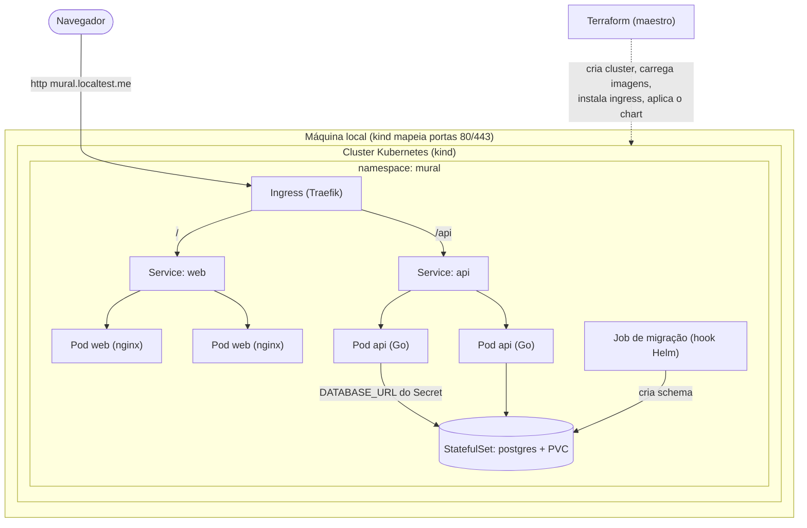

# Arquitetura-alvo

O estado que você deve alcançar no cluster ao final do desafio. Um único
`terraform apply` deve sair do nada até tudo isto no ar.

## Visão geral

## Peças e responsabilidades

| Peça | Papel | Detalhe que importa |
|------|-------|---------------------|
| **Terraform** | Maestro idempotente | Cria o cluster kind, builda/carrega as imagens, instala o Traefik e aplica o chart. `apply` 2x não recria nada; `destroy` limpa tudo. |
| **Helm chart** | Empacota os manifests | Deployment (api/web), StatefulSet+PVC (postgres), Services, Ingress, ConfigMap, Secret, Job de migração. |
| **Ingress** | Porta de entrada | `/` → front, `/api` → API. Exposto em `localhost` via port-mapping do kind. |
| **Front (nginx)** | Serve estático + proxy | Não conhece a URL absoluta da API — faz proxy de `/api` via `${API_UPSTREAM}`. |
| **API (Go)** | Regra da app | `/healthz` (liveness) não toca no banco; `/readyz` (readiness) só passa com o schema pronto. |
| **Postgres** | Estado | StatefulSet + PVC (padrão correto de banco em K8s). Senha vem de Secret. |
| **Job de migração** | Sobe o schema | Roda antes de a API ficar pronta. É o que a readiness da API espera. |

## Fricções intencionais (o que costuma travar — de propósito)
1. **Migração antes do boot** — a API não cria a tabela; sem migração, a readiness nunca passa.
2. **Probe certa no lugar certo** — ligar a *liveness* no `/readyz` derruba o pod antes da
   migração (CrashLoop). Liveness ≠ readiness.
3. **Secret, não hardcode** — a `DATABASE_URL` carrega senha; ela tem que vir de um Secret.
